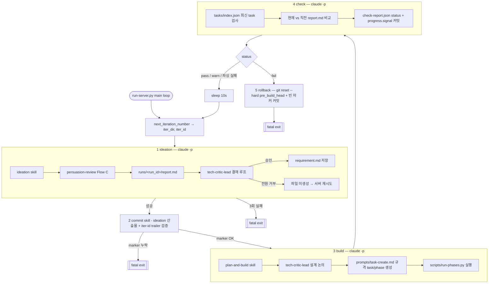

# BET (베스트 트레이닝)

PT 세션 데이터를 트레이너가 입력하고, 회원별 발전 추이를 꺾은선 그래프로 시각화하는 트레이너 전용 MVP.

- 제품 비전 / 가치제안 / 비즈니스 모델 → [docs/mission.md](docs/mission.md)
- 현재 이터레이션 스펙 (라우트, 데이터 모델, 인증, CSV export 계약) → [docs/spec.md](docs/spec.md)
- 테스트 정책 → [docs/testing.md](docs/testing.md)
- 배포 / 운영 수동 개입 절차 → [docs/user-intervention.md](docs/user-intervention.md)

## 스택

Python 3.12 · FastAPI · SQLite (stdlib `sqlite3`, ORM 없음) · Jinja2 · HTMX · Chart.js · pytest + Playwright · Fly.io 배포.

## 로컬 실행

```bash
uv sync --extra dev
uv run playwright install chromium

APP_SESSION_SECRET=dev-secret-change-me \
ADMIN_USERNAME=admin \
ADMIN_PASSWORD=password \
uv run uvicorn app.main:app --reload
```

브라우저에서 <http://localhost:8000> 접속 → 위 `ADMIN_USERNAME` / `ADMIN_PASSWORD`로 로그인.

필수 환경변수 3개(`APP_SESSION_SECRET`, `ADMIN_USERNAME`, `ADMIN_PASSWORD`)가 없으면 부트 시 `RuntimeError`로 fail-fast한다.

## 테스트

```bash
uv run pytest
```

mock / ORM 금지. DB는 각 테스트마다 temp SQLite 파일. 상세 원칙은 [docs/testing.md](docs/testing.md).

## 트레이너 계정 관리

웹 UI 없음. 스크립트 only:

```bash
uv run python -m scripts.seed_trainer --name "이름" --username <id> --password <pw> [--owner]
```

동일 `--username` 재실행 시 비밀번호 upsert. 자세한 운영 절차(관장 교체, 백필 등)는 [docs/user-intervention.md](docs/user-intervention.md).

## 배포

Fly.io 단일 VM + 영속 볼륨. `fly.toml` 참고. 최초 배포 / 재배포 명령은 [docs/user-intervention.md](docs/user-intervention.md).

## 디렉토리

```
app/         FastAPI 앱 (routes, auth, db, aggregates, templates)
scripts/    CLI 유틸 (seed, backfill, run-server)
tests/      pytest 스위트
docs/       스펙 · 미션 · 운영 문서
iterations/ 이터레이션별 산출물 (스크린샷 등)
```

## 자율 주행 하네스

`scripts/run-server.py`는 사람 개입 0회로 "고객 시뮬 → 요구사항 채택 → 구현 → 검증 → (실패 시) 롤백"을 무한 반복하는 무인 개발 루프다. 각 이터레이션은 독립된 `claude -p --dangerously-skip-permissions` 세션을 순차적으로 띄우고, 세션마다 `HARNESS_HEADLESS=1` 환경변수를 주입해 skill 본문에 박힌 사용자 confirm 단계를 전부 자동 승인으로 오버라이드한다. (구명 `BET_HEADLESS` 도 당분간 함께 주입되며 SKILL.md 쪽에서 fallback 으로 수용 — `@TODO REMOVE LEGACY` 마커와 함께 전환 완료 후 제거 예정.)

### 1 이터레이션의 구성

| 단계 | 호출 대상 | 실패 시 | 로그 |
|------|-----------|---------|------|
| 1. ideation | `ideation` skill → 내부에서 `persuasion-review` skill + `tech-critic-lead` 서브에이전트 호출 | `requirement.md` 미생성 시 최대 3회 재시도 후 fatal | `ideation-{N}.log` |
| 2. commit (ideation) | `commit` skill | `iter-id` trailer 누락 시 fatal | `commit.log` |
| 3. build | `plan-and-build` skill → `tech-critic-lead` 서브에이전트와 설계 논의 → `scripts/run-phases.py` 로 phase 순차 실행 | non-zero exit는 경고만, check로 진행 | `build.log` |
| 4. check | 커스텀 프롬프트 (skill 없음) — 최신 task의 phase 상태와 `persuasion-data/runs/<run_id>/report.md` 를 직전 iteration과 비교 → `check-report.json` 커밋 | marker 검증 실패는 경고만 | `check.log` |
| 5. rollback | 커스텀 프롬프트 — `git reset --hard <pre_build_head>` + 빈 마커 커밋 | check=fail일 때만 실행, 이후 fatal | `rollback.log` |

모든 커밋에는 `iter-id: {N}-{YYYYMMDD_HHMMSS}` trailer가 붙고, 서버가 `git log` 로 직접 검증한다. 누락된 커밋이 하나라도 있으면 ideation/commit 단계에서는 프로세스가 종료된다 (오염된 히스토리를 방치하지 않기 위함).

### 상호작용하는 구성요소

- **Skills** (`.claude/skills/`)
  - `ideation` — `persuasion-data/personas/` 중 첫 번째 페르소나로 시뮬을 돌리고, 리포트에서 후보 3-5개를 추려 `tech-critic-lead` 에 1순위부터 결재 요청. 승인된 후보만 `requirement.md` 로 기록.
  - `persuasion-review` — `ideation` 내부에서 Flow C(가치제안 draft → `run_simulation.py` → `report.md`)만 호출된다. 무인 모드에서는 Flow A(페르소나 생성) 진입 자체가 금지.
  - `commit` — 이터레이션 디렉토리의 `requirement.md`, `persuasion-data/runs/<run_id>/*` 만 staging. `iterations/**/*.log` 는 계속 커지는 세션 로그라 커밋 대상 제외.
  - `plan-and-build` — docs 파악 → `tech-critic-lead` 와 설계/테스트 논의 → `prompts/task-create.md` 규격으로 task/phase 파일 생성 → `scripts/run-phases.py` 로 실행.
- **Sub-agent** (`.claude/agents/tech-critic-lead.md`) — "기능은 비용" 전제의 비판적 CTO. ideation에서는 요구사항 승인 게이트, plan-and-build에서는 설계 상대. Read/Grep/Glob/Bash 만 쥐고 있어 쓰기는 불가.
- **헤드리스 오버라이드** — 각 skill SKILL.md는 세션 첫 동작으로 `echo "HEADLESS=${HARNESS_HEADLESS:-${BET_HEADLESS:-0}}"` 를 실행하도록 강제되고, `1` 이면 "단 한 번만 묻는다"류의 상위 지시까지 모두 무효화된다. (`BET_HEADLESS` fallback 은 legacy, `@TODO REMOVE LEGACY` 마커와 함께 제거 예정.)
- **진척도 판정** — check 단계가 이번 `report.md` 와 직전 iteration `report.md` 를 비교해 `progress.signal ∈ {improved, regressed, inconclusive, no_prior_run}` 을 기록. `status ∈ {pass, warn, fail}` 중 `fail` 만 rollback + fatal로 이어진다.

### 흐름도



check가 `fail` 이거나 ideation/commit 단계에서 치명 오류가 나면 프로세스는 종료되고 호출자(사람 또는 상위 supervisor)가 후속 조치한다. reflog 는 남아있으므로 rollback 은 회복 가능하다.
